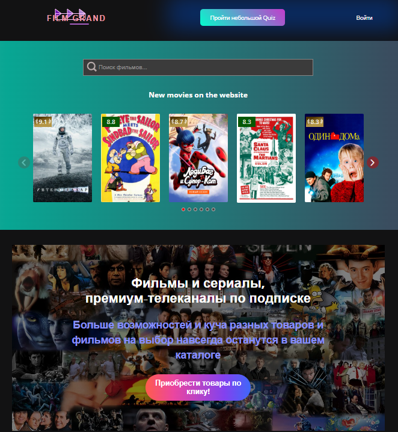

# 🎬 Movie Explorer App | React + RTK Query + TypeScript  

  

  

## 🚀 Features  
- **Real-time movie search** (debounced API requests)  
- **Interactive Swiper slider** for trending movies  
- **Movie quiz game** (test your film knowledge)  
- **Mock shopping cart** (add/remove movies)  

## 🛠 Tech Stack  
- **React** + **TypeScript**  
- **Redux Toolkit Query** (RTK Query) for API state management  
- **Swiper.js** for sliders  
- **React Hook Form** for forms  
- **MSW (Mock Service Worker)** for API mocking (dev) 
